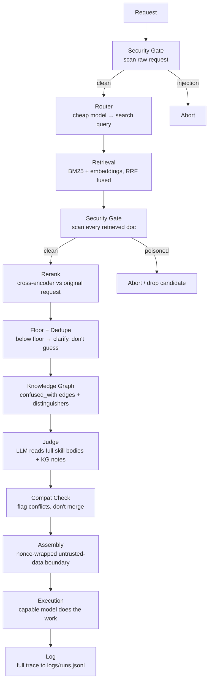
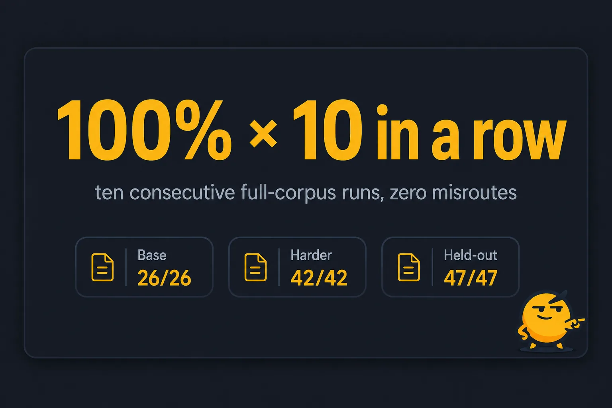
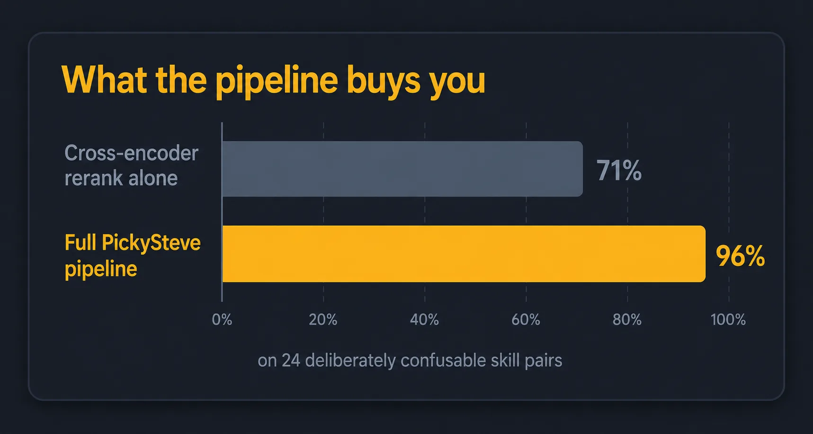
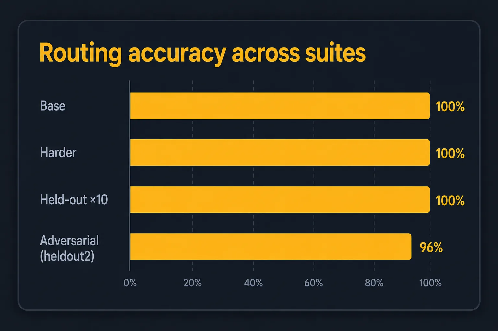
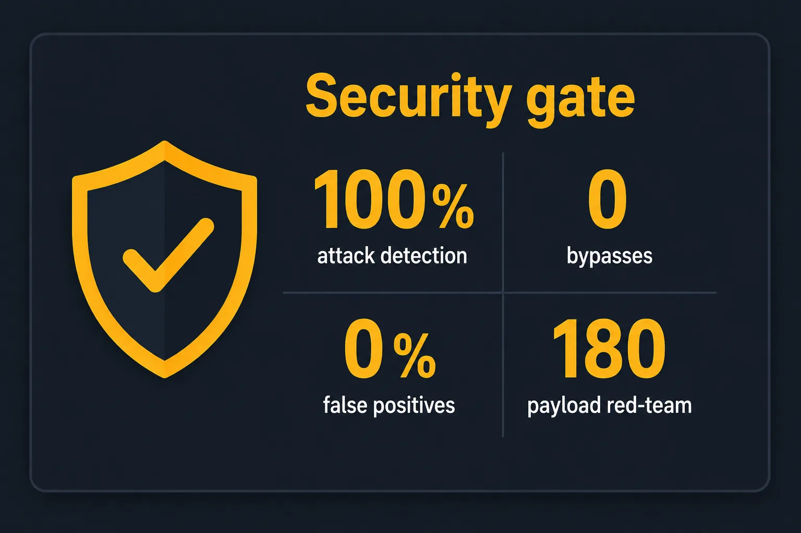
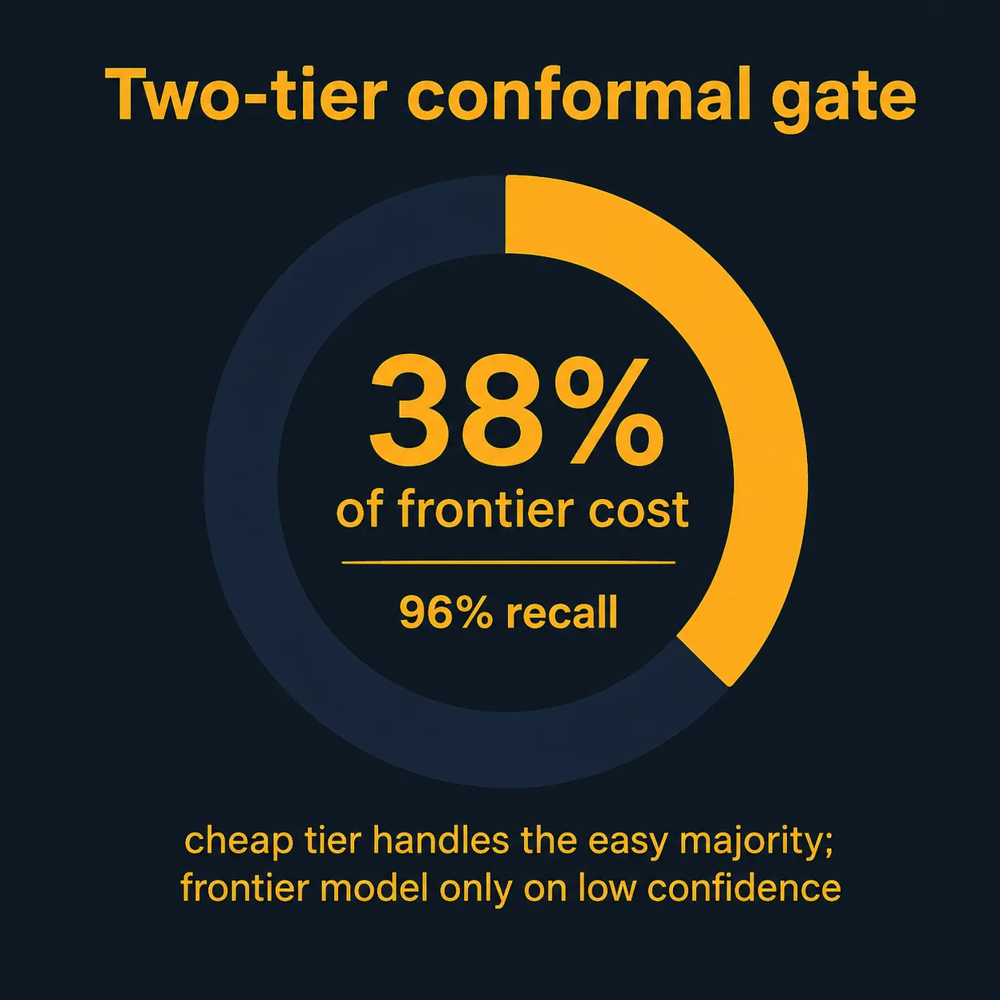

<p align="center">
  
</p>

<h1 align="center">PickySteve</h1>

<p align="center">
  <em>Picks the right skill for your coding agent. Picky about what he loads into context, including what he refuses to load.</em>
</p>

### ▶ Watch the trailer

https://github.com/user-attachments/assets/8750946b-36be-4c48-bf73-79513451d1f5

<p align="center">
  
  
  
</p>

PickySteve is a lightweight orchestration layer. A cheap model figures out which skill a request
actually needs, retrieves that one skill, and hands a small, focused, untrusted-data-boundaried
context bundle to a capable model. It does not dump every tool and document you own into context
on every request.

This repo is Phase 1 (MVP), built to an architecture spec. Phase 2 work (tracing platform,
standing eval harness, credential vault, sandbox) is not built yet. Each piece gets added only
when a real Phase 1 failure justifies it.

## 30-second quickstart

```bash
# from the repo root (Windows; uv 0.10+, Ollama with qwen3:8b running locally)
uv venv --python 3.11 .venv
uv pip install --python .venv/Scripts/python.exe -r requirements.txt

# calibrate the reranker floor on the labeled set
.venv/Scripts/python.exe eval/calibrate.py

# run one request
.venv/Scripts/python.exe -m pickysteve "review my Rust endpoint for security and REST design"
```

> **Note:** this is currently a `uv` / `git clone` install. There is no PyPI package yet, so
> `uvx pickysteve` and `pipx install pickysteve` do not exist. If that changes, this section
> gets a one-liner. For now, the fastest path to a real coding agent is the connector installer
> below.

### Wire it into your agent (one command)

```bash
python -m pickysteve.connectors.install --list   # see which of 18 agents are detected
python -m pickysteve.connectors.install --all    # wire every detected agent (backs up configs first)
```

Supports **Claude Code, Codex, Cursor, Windsurf, Cline, Roo Code, Gemini CLI, Qwen Code, Goose,
OpenHands, GitHub Copilot, Kimi Code, OpenCode, ZeroClaw** via MCP stdio, and **Aider, Hermes,
OpenClaw, NanoClaw** via an OpenAI-compatible proxy on `:8077/v1`. Full per-agent config snippets
and the connectivity matrix are in [`INTEGRATIONS.md`](INTEGRATIONS.md).

## How it works



Ten stages: gate, route, retrieve, gate again on retrieved content, rerank, floor/dedupe,
knowledge-graph context, judge, compat-check, assemble, execute, log. The second gate pass scans
every retrieved candidate, not just the user's request. Most similar projects skip that pass, and
it is the highest-risk surface: a poisoned skill doc is attacker-controlled content sitting right
next to your execution model.

## The stack (and why)

| Role | Choice | Note |
|---|---|---|
| Runtime | **Python 3.11** via `uv` | The default Python here is 3.14, which still has shaky `torch` wheels. `uv` pins an isolated 3.11 venv where the ML stack is stable. |
| Security gate | **`stackone-defender[onnx]`** | The real StackOne defender (Python port, v0.7.2), not a regex placeholder. Bundled ~22MB ONNX classifier, no download. |
| Router / compat / clarify / execution | local Ollama `qwen3:8b` via the **native `/api/chat` (`think:false`)** | Runs with no cloud key. The OpenAI-compat endpoint does not honor thinking control for qwen3 (it dumps output into a `reasoning` channel and leaves `content` empty, roughly 20x slower), so the client uses the native endpoint by default. Set `PS_OLLAMA_NATIVE=0` / `PS_LLM_BASE_URL` for any OpenAI-compatible host. |
| Retrieval | **`rank_bm25`** + **`sentence-transformers`** embeddings, fused with RRF | Hybrid keyword + dense. |
| Reranker | **`BAAI/bge-reranker-base`** cross-encoder | Exactly the model the spec names. Its output is a logit, not a probability, so the floor is calibrated rather than guessed. |
| Logging | flat **JSONL** | Manual review is the Phase-1 eval process. |

Total Phase-1 dependencies: `stackone-defender`, `rank-bm25`, `sentence-transformers`,
`openai`, `numpy`. That is the minimal set the spec prescribes.

## Two decisions the spec left open (decided and documented)

- **Retrieval unit (§2.3):** each markdown file is one retrieval unit. A skill folder with
  several files (see `registry/rag-architecture/`) yields multiple units sharing a `skill_id`.
  After reranking, units from the same skill collapse to the best one in assembly, so the
  execution model never receives three chunks of one skill.
- **Gate policy on a poisoned retrieval (§2.1):** default `RETRIEVED_INJECTION_POLICY=abort`. If
  a retrieved candidate trips the gate (high-risk), the whole request aborts. The documented
  alternative is `drop`, which discards just that candidate and continues. For allowed-but-
  sanitized content, the pipeline uses the Tier-1-sanitized text downstream (defense in depth)
  and logs that sanitization happened.

## Refinements after a 21-agent adversarial review

The first validation surfaced three failures. Fixing them, and adversarially reviewing the
fixes, added these mechanisms. See [`FINDINGS.md`](FINDINGS.md) for the full before/after.

- **Tier-3 escalation (gate, request path only):** a legitimate question about prompt injection
  was being blocked. The request gate now enables the defender's Tier-3 LLM hook over the gray
  band `[0.64, 0.85)`, just above the model's calibrated 0.64 block threshold. A cheap
  adjudicator can rescue a would-be block but never flip a would-be allow, while near-certain
  attacks (≥0.85) still hard-block without consulting it. Retrieved third-party content never
  escalates (strict gate).
- **Multi-intent router with §2.4-safe rescue:** the router emits sub-queries and retrieval
  unions across them for recall. Reranking stays governed by the original request (§2.4). Only a
  genuinely compound request (two or more distinct sub-intents) also maxes over its sub-queries,
  to surface a secondary intent the full-request score would bury.
- **Relative-dominance gate:** a secondary skill is kept only if it scores at least
  `DOMINANCE_RATIO` (0.08) times the top skill. This keeps PickySteve picky instead of dumping
  marginal tag-alongs.
- **Honest #13 fix:** a correct skill that the reranker under-scored was fixed by enriching the
  skill doc with real symptom vocabulary, not by lowering the floor onto leaked data. The floor
  is recalibrated on a leakage-free labeled set with hard-negatives.

## Benchmarks

All numbers below come from this repo's own eval docs and logs.

<p align="center">
  
</p>

<p align="center">
  
  
</p>
<p align="center">
  
  
</p>

**Routing accuracy, the trifecta** ([DEEP_CONTEXT.md](DEEP_CONTEXT.md)):

| Suite | Tasks | Result |
|---|---|---|
| Base | 26 | **100% × 10 consecutive runs** (qwen3 judge) |
| Harder (base + 16 brutal adversarial) | 42 | **100% × 10** (qwen3 judge) |
| Held-out (unseen, fresh confusion mechanisms) | 47 | **100% × 10** (Claude blind judge) |
| Heldout2 (hardest, deliberately unsaturated adversarial set) | 24 | **23/24 (96%)**. One genuine miss on a compound canary/feature-flag task where the trap ranked above gold (`logs/heldout2_final_run.log`) |

The heldout2 set is kept deliberately hard and unsaturated. New confusable-pair tasks get added
faster than the router/rerank stack is re-tuned, so it acts as a running canary for regressions
rather than a suite that is expected to hit 100%.

On a 40-request held-out accuracy set with no calibration overlap ([TEST_REPORT.md](TEST_REPORT.md)):
**90% overall correct**, **100% top-1 accuracy (30/30 answerable)**, **96.7% full recall**,
**MRR 1.000**, **100% off-domain rejection** (haiku/recipe requests correctly get `no_confident_match`).

**Two-tier gate (recall-all + conformal abstention).** The cheap local judge routes singleton
predictions directly; ambiguous cases escalate to a frontier judge (`logs/two_tier.out`):

| Metric | Result |
|---|---|
| Conformal coverage | 44/47 = 94% |
| Routed cheap (singleton) | 29/47 = 62%, correct 27/29 |
| Escalated to frontier | 18/47 = 38%, correct 18/18 |
| **Combined top-1** | **45/47 = 96%** |

**Security, red-team detection** ([SECURITY_AUDIT.md](SECURITY_AUDIT.md), [TEST_REPORT.md](TEST_REPORT.md)):

- 180-payload corpus (129 attack / 51 benign, 14 evasion families): **100% attack detection,
  zero bypasses** after hardening. The baseline was 86%.
- Separate 115-attack corpus: **97.6%** detection on the request path, **96.5%** on retrieved
  content, up from 87.1%. Benign false-positive rate held at **0.0%** throughout.
- On the adversarial 180-payload corpus, benign-allow rate is 61% (39% false-positive on
  deliberately tricky security-flavored prompts). On the real skill registry, false positives
  are **0/43**, verified by a startup-time warm pass the server refuses to serve without.

**Trap-registry ranking test** ([SIM_REPORT.md](SIM_REPORT.md)): 24 skills built to confuse a
naive matcher, 14 tasks. The gold skill outranked every trap **13/13 (100%)**, correct top-1 on
12/13 answerable tasks, correct no-match handling 1/1.

## Why not just RAG or LangGraph?

- **It does not retrieve everything and let the model sort it out.** The floor, dedupe, and
  dominance-ratio gate exist so the execution model never sees marginal tag-along documents. The
  goal is picking one thing, not five plausible things.
- **It is not a bigger orchestration framework.** There is no state machine and no LangGraph-style
  graph runtime. Phase 1 is five Python modules (`retrieval.py`, `rerank.py`, `router.py`,
  `security_gate.py`, `pipeline.py`). See "Phase 1 non-goals" below for what is left out (no
  knowledge-graph-as-default, no standing eval harness, no sandbox) until a real failure justifies
  adding it.
- **The security gate is not a bolt-on.** Most RAG setups treat retrieved documents as trusted
  once they clear a similarity threshold. PickySteve scans retrieved content through the same
  injection gate as the user's request, fail-closed, before it ever reaches assembly.

> [!IMPORTANT]
> **Two-scan, fail-closed by design.** Every request is scanned twice: once raw before routing,
> and once per retrieved candidate before assembly. Either scan can abort the request or drop a
> single poisoned candidate. On timeout, error, or an ambiguous LLM adjudication, the gate fails
> closed. Nothing ambiguous reaches the execution model silently.

> [!IMPORTANT]
> **Untrusted content never becomes instructions.** Retrieved skill docs are wrapped in a
> per-call random-nonce boundary (`<<UNTRUSTED-{nonce}>>...<<END-{nonce}>>`) before being handed
> to the execution model, so a poisoned doc cannot forge a `[SYSTEM]:` directive or close the
> boundary early. This was hardened after a real finding: static delimiters were forgeable by a
> crafted skill body (see [`SECURITY_AUDIT.md`](SECURITY_AUDIT.md), "assembly.py" row).

Live visualizer: open [`assets/pickysteve_live.html`](assets/pickysteve_live.html) in a browser
to watch Steve step through gate, router, retrieval, rerank, judge, and assembly on a sample
request. For the terminal-native version, `eval/run_examples.py` streams the same stage-by-stage
trace to `logs/runs.jsonl` as it drives the 18 example requests end to end.

## Core principle

Confidence and relevance scores measure topical similarity, not correctness. Nothing here claims
a retrieval was right, only that it was plausible. All retrieved content is treated as low-trust
data, never as instructions.

## Known limitations

- **qwen3-calibrated thresholds.** The reranker floor and the Tier-3 escalation gray band are
  calibrated against `qwen3:8b` as router/judge. Swapping the local model requires re-running
  `eval/calibrate.py`. Thresholds are not portable across judges by assumption.
- **Latin-script non-English prompt injection residual.** Spanish-language injection can still
  bypass the bundled English-only classifier in some cases. This is a gap in the bundled ONNX
  model, not a logic bug in the gate wiring.
- **Heldout2 residual item.** One genuine miss (task #12, a compound canary/feature-flag-vs-
  blue-green case) where the trap outranked gold. See the benchmarks table above and
  `logs/heldout2_final_run.log` for the full trace.
- The reranker (`bge-reranker-base`) takes roughly 2s per 8 candidates on CPU and dominates
  end-to-end latency.
- The router can occasionally over-decompose a single intent into multiple facets, surfacing a
  marginal secondary skill.
- Five spec-level open logic gaps remain by design (see below) and [TEST_REPORT.md](TEST_REPORT.md) §6.

### Open logic gaps (carried forward from the spec)

1. **Confidence is not correctness.** The rerank score is topical similarity, not outcome quality. There is no outcome feedback loop; that needs labeled real results over time.
2. **The router can be wrong.** Intent decomposition for vague or compound requests is a hard reasoning problem.
3. **Skill-conflict resolution is unsolved.** The compat check flags conflicts rather than resolving them.
4. **"Compatible skills can be combined" has no concrete definition.** There is no automatic skill-merging.
5. **No recency or trust weighting in retrieval.** A stale skill ranks the same as a fresh one at equal relevance. Staleness is flagged, not down-weighted.

### Phase 1 non-goals (intentionally absent)

No knowledge graph or LightRAG as the default path, no LangGraph or state-machine framework, no
external tracing (Laminar/Langfuse), no credential vault, no automated eval harness
(DeepEval/Ragas), no sandbox runtime. Each is added in Phase 2 only when a real Phase-1 failure
justifies it.

## FAQ

**How is the judge not gamed?**
Two independent judges run across the eval suites: a local `qwen3:8b`, and a Claude-blind-judge
mode where Claude picks the root-cause skill without seeing the labeled answer. When they
disagree, it is informative. On the hardest adversarial subset, Claude scored lower (86%) than the
local judge (91%) because it disputed a couple of debatable labels. That divergence is treated as
a signal the label is ambiguous, not proof the judge is wrong ([DEEP_CONTEXT.md](DEEP_CONTEXT.md)).
Every model call in the eval pipeline is cached, so a given pass rate is deterministic and
reproducible.

**Isn't this just RAG?**
Retrieval is one stage out of ten. The stages that are not RAG (the two security gates, the
reranker floor/dominance-ratio gate, the compat check, and the nonce-wrapped untrusted-data
boundary) are where most of the engineering and most of the fixed bugs went. Plain RAG does not
refuse to answer when nothing clears a calibrated floor, and it does not re-scan its own retrieved
documents for injection before use.

**What happens on no confident match?**
PickySteve returns `no_confident_match` and asks a clarifying question instead of guessing. The
floor is calibrated on a labeled good/bad set rather than hand-tuned, and the documented
philosophy is that confidence measures topical similarity, not correctness. When nothing clears
the bar, a question beats a wrong pick. Off-domain rejection has tested at 100% across every
held-out suite.

**Does it work with tools that don't support MCP?**
Yes. An OpenAI-compatible proxy (`pickysteve.connectors.http_server`, port 8077) sits in front of
any tool that takes a custom OpenAI base URL (Aider, Hermes, ZeroClaw, OpenCode, OpenClaw,
NanoClaw). There is also a REST `/pick` endpoint and a direct Python import for anything else. See
[`INTEGRATIONS.md`](INTEGRATIONS.md) for the full connectivity matrix across 18 agents.

**What are the known limitations?**
See the "Known limitations" section above and [TEST_REPORT.md](TEST_REPORT.md) §6.

## Setup

```bash
# from this directory (Windows; uv 0.10+, Ollama with qwen3:8b running locally)
uv venv --python 3.11 .venv
uv pip install --python .venv/Scripts/python.exe -r requirements.txt
```

## Use

```bash
# 1) Calibrate the reranker floor on the labeled set (writes eval/calibrated_floor.json)
.venv/Scripts/python.exe eval/calibrate.py

# 2) Run a single request
.venv/Scripts/python.exe -m pickysteve "review my Rust endpoint for security and REST design"

# 3) Run the 18 example requests end to end (traces -> logs/runs.jsonl)
.venv/Scripts/python.exe eval/run_examples.py          # add --no-exec to skip the execution model

# 4) The mandatory security-gate test
.venv/Scripts/python.exe tests/test_security_gate.py
```

Config is all environment variables (`PS_*`). See `pickysteve/config.py`.

## Connect it to your coding agent

```bash
# MCP (Claude Code, Codex, Cursor, Windsurf, Cline, Roo, Gemini CLI, Qwen Code, Goose, ...):
.venv/Scripts/python.exe -m pickysteve.connectors.mcp_server      # exposes pick_context + list_skills

# OpenAI-compatible proxy (Aider, Hermes, ZeroClaw, ...): point the tool's base URL at :8077/v1
.venv/Scripts/python.exe -m pickysteve.connectors.http_server     # /pick + /v1/chat/completions
```

Full per-agent config snippets, the one-command installer, and the Obsidian second-brain export
(`python -m pickysteve.connectors.obsidian --vault <path>`) are documented in
[`INTEGRATIONS.md`](INTEGRATIONS.md).

## Contributing

See [`CONTRIBUTING.md`](CONTRIBUTING.md) for dev setup, the eval/test suite layout (what is a
fast pre-commit check vs. what needs a live Ollama), the rule that any routing-affecting change
must re-run the base/harder/held-out trifecta before merge, and code-style conventions.

## Credits

Trailer music: "Powerful Emotional Trailer" by MaxKoMusic, via [Chosic](https://www.chosic.com/free-music/all/),
licensed under [CC BY-SA 3.0](https://creativecommons.org/licenses/by-sa/3.0/).

## License

[MIT](LICENSE). See the `LICENSE` file for the full text.
